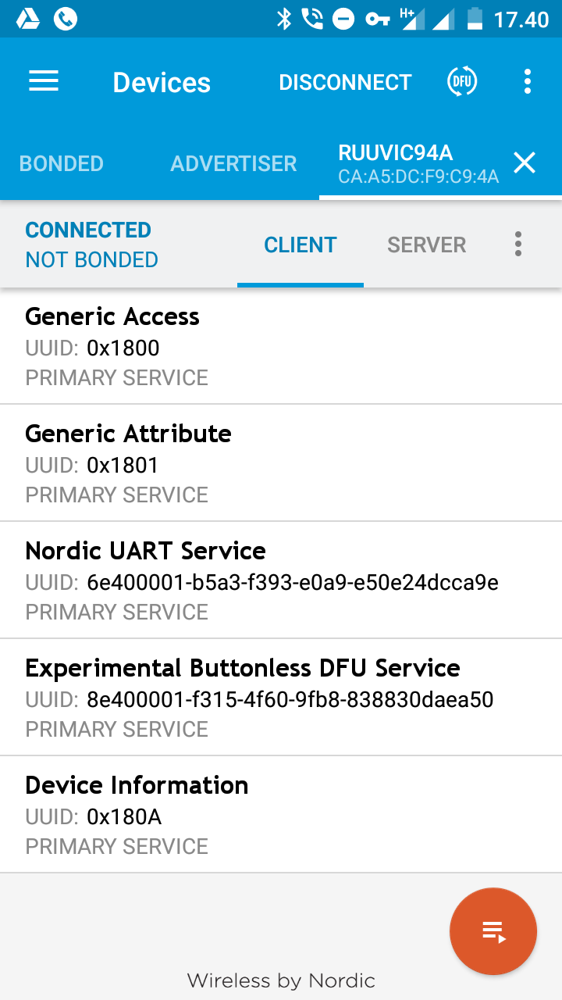
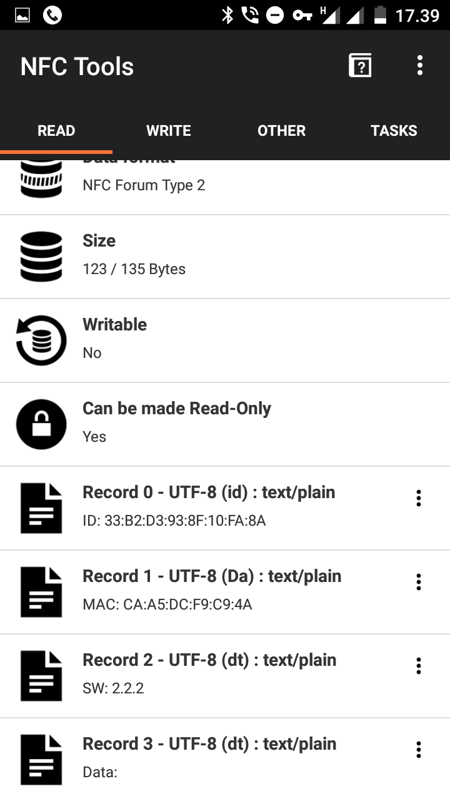

# Ruuvi firmware
 * Has GATT connectivity with Device Information Service and DFU Service, as well as currently unused Nordic UART Service. 
 * 
 * Data is sent in [Manufacturer specific format, Ruuvi V5](https://github.com/ruuvi/ruuvi-sensor-protocols).
 * Tag is connectable for 30 seconds after NFC read or button press and advertises name "RuuviXXXX" in scan response.
 * Uses 16x IIR on BME280, which reduces noise at the expense of slowed response time. Practically the response is limited by enclosure, so
   slowdown is noticeable only if the enclosure is open. 
 * Does not send data before sensors are read at least once to avoid invalid data transmissions.
 * Sends at 10 Hz for 30 seconds on boot to speed up detection of recently booted tags.
 * ID and MAC address of data are readable via NFC

 * 1 Hz +4 dBm transmission on RAW mode
 * Consumes approximately 30 uA in RAW mode.

 * Theoretical lifetime is approximately 3 years in RAW mode.
 * Enter bootloader by holding "B" down while resetting, assuming you're running the "Full" hex which contains softdevice + bootloader + application.

# Changelog

## 2.x versions
### 2.3.1 
  - Connectible only for 30 seconds after user interaction by default.

### 2.2.2
 - Advertises in RAWv2 format. 
 - Adds GATT connectability over 1.X branch

## 1.x versions
### 1.2.12
 - RuuviTags ship with this firmware.
 - Sends data in RAWv1 format at 1 Hz interval by default.
 - Toggle to URL format by button press.
 - Source is available at V1-backports -branch
