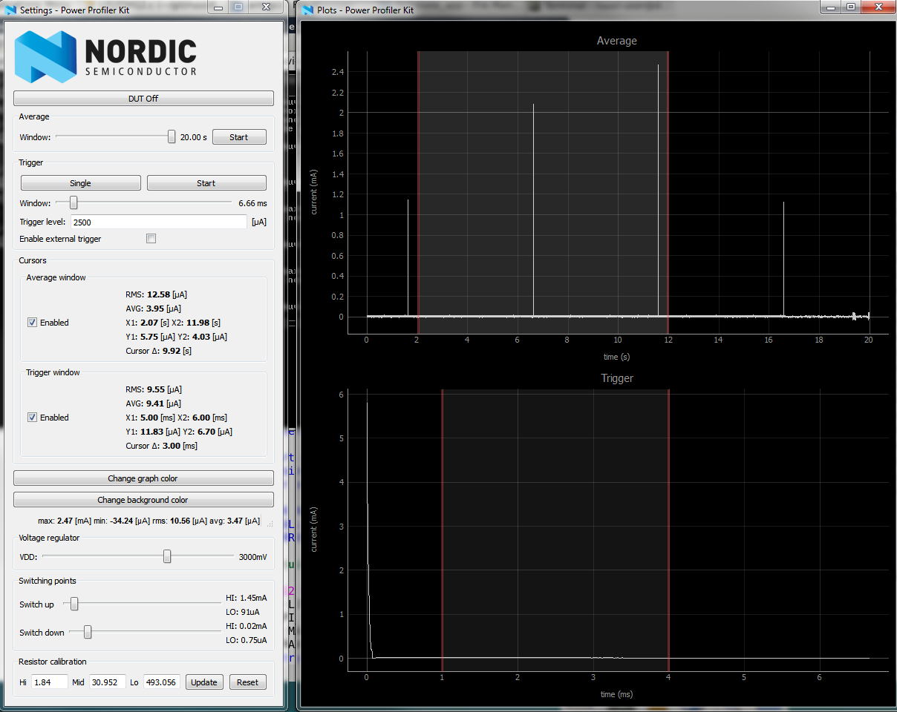
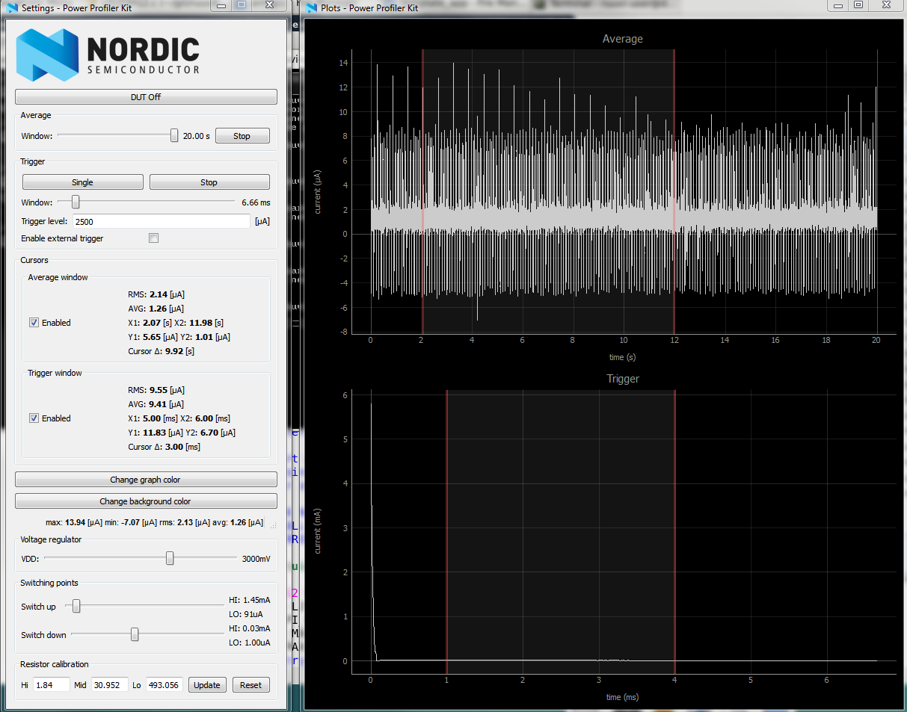
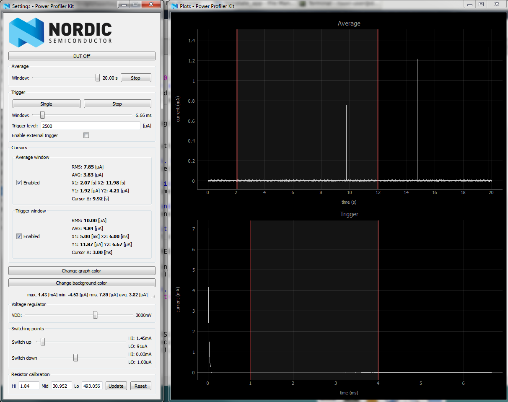

#Template app

This application has bare bones initialization code
for sensors and BLE stack. It should be used as a 
starting point to create new applications.

Application runs the initialization sequence and turn RED LED
on for 3 seconds if the initialization was succesful and waits one minute
for user to press the user button. If the button is not pressed, 
application goes to shutdown mode. 

If the user presses button, main application loop starts.
Green led will turn on whenever there is 
activity on board, however it is not visible
in this demo because there is so little activity.
If the green led is continously on 
your application has not entered proper sleep mode 
or it is otherwise consuming a lot of CPU time which 
leads to short battery life. Notably the function `nrf_delay_ms()`
prevents nRF52 entering low power sleep mode.

#Assumptions
The application is meant to run on RuuviTag B3 with sensors installed.
Future revisions of boards are software-compatible. 

Program can be used with RuuviTag without sensors if `sensors_init()` is commented out.

Program requires Nordic Softdevice 3 for timer and clock initialization.

#Application structure
Application starts execution from main.c in project folder. 
Board- and project-specific init files are in folder
$BOARD/s132/ .

Configuration files for specific board and project are under $BOARD/s132/config .

Files used on this project by every board is under main project folder.

Drivers and libraries shared across all projects can be found at top-level
of repository under folders "drivers/" and "libraries/".

#Power profiles
RuuviTag B3 waiting for user button press

RuuviTag B3 in power down mode

RuuviTag B3 in main loop.

